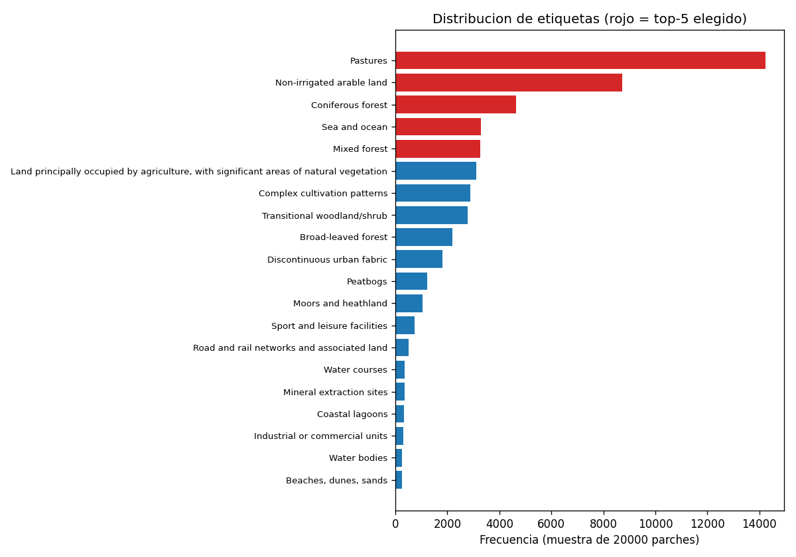
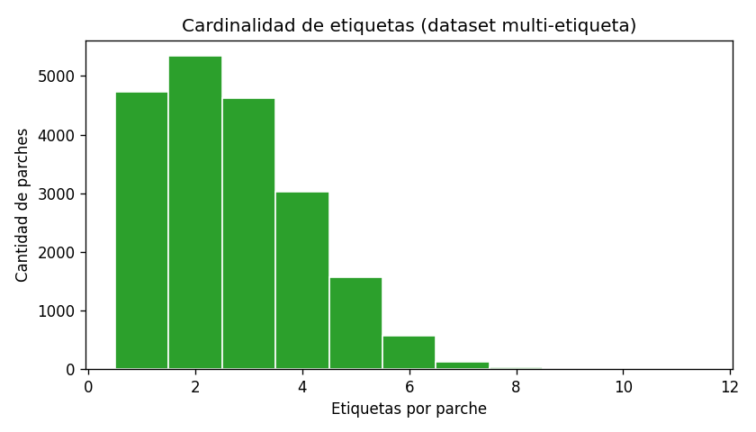
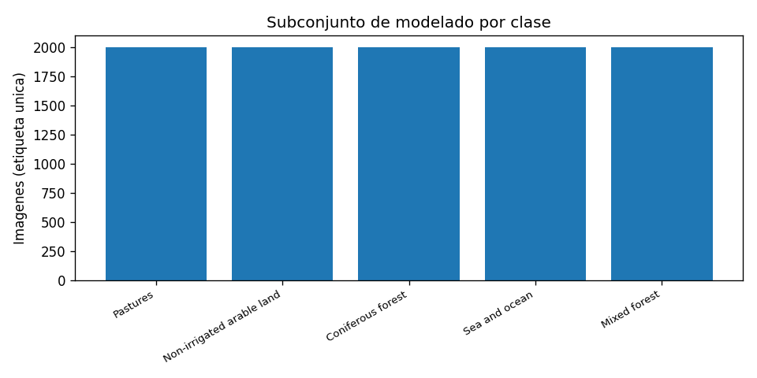
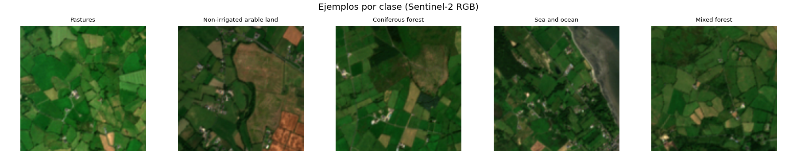
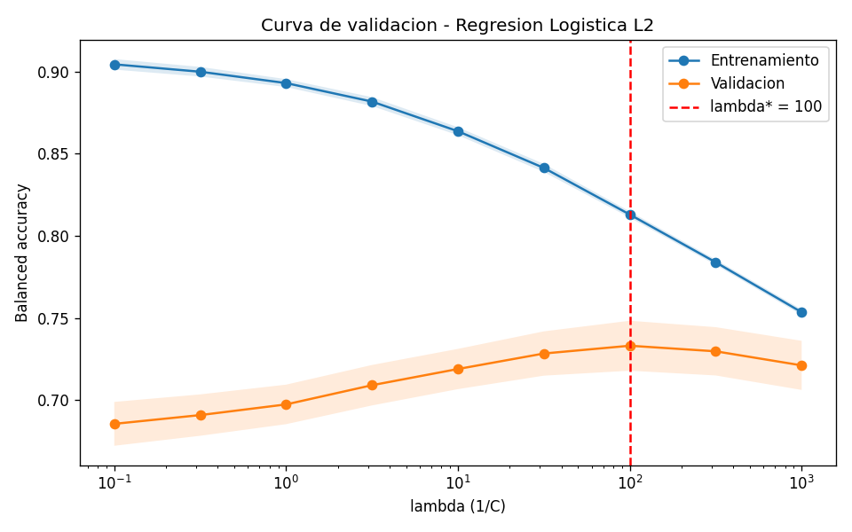
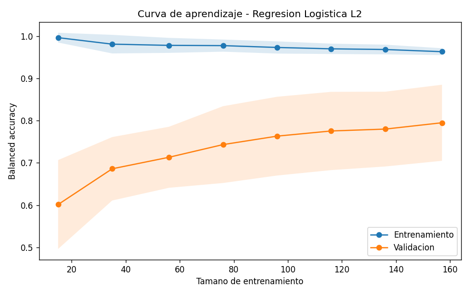
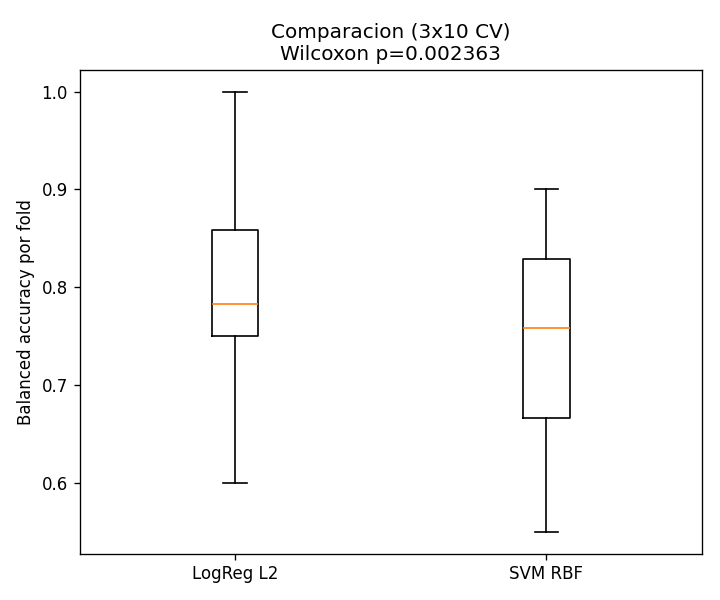
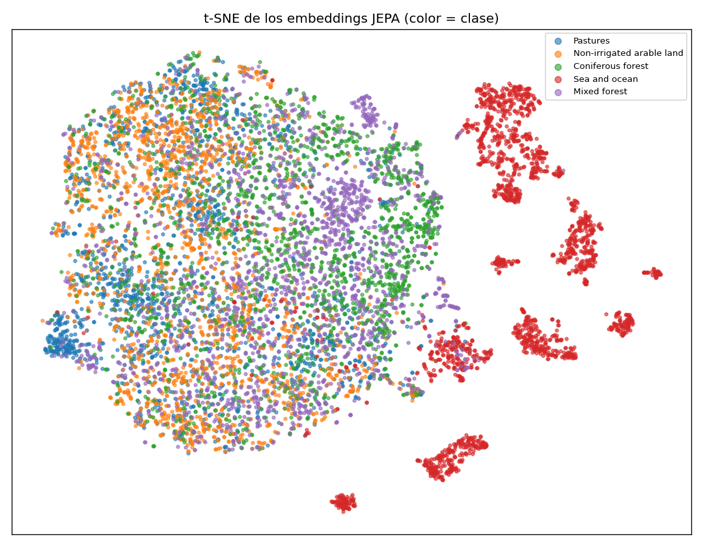

# BigEarthNet-S2 + JEPA + clasificador clásico

## Introducción

La clasificación de cobertura terrestre a partir de imágenes Sentinel-2
es clave para el monitoreo ambiental, pero etiquetar parches es costoso;
interesa reutilizar **representaciones auto-supervisadas**. Este proyecto
usa **I-JEPA ViT-H/14 (Meta AI) congelado** como extractor de
características sobre BigEarthNet-S2 (`s2-rgb`) y, sobre esos *embeddings*
(1280-D), monta clasificadores clásicos para distinguir las **5 clases
más frecuentes**. Se **optimiza** la Regresión Logística L2 y se
**compara estadísticamente** contra una SVM RBF (Wilcoxon).

## 1. Datos y EDA

- Parches escaneados: **20 000**; etiquetas CLC únicas observadas: **35**;
  promedio **2.69** etiquetas/parche (dataset multi-etiqueta).
- Top-5 (orden de frecuencia): **Pastures** (14 236), **Non-irrigated
  arable land** (8 737), **Coniferous forest** (4 635), **Sea and ocean**
  (3 302), **Mixed forest** (3 276).
- Subconjunto de modelado: **10 000** imágenes, **balanceado a 2 000/clase**
  (asignación *greedy* sobre parches con ≥1 etiqueta del top-5).
- Métrica: **balanced accuracy** (las clases del problema se equilibran;
  evita inflar el resultado por la clase mayoritaria).

| Frecuencia de etiquetas (top-5 resaltado) | Etiquetas por parche |
|---|---|
|  |  |

| Balance del subconjunto (2 000/clase) | Ejemplos RGB por clase |
|---|---|
|  |  |

## 2. Optimización de hiperparámetros (Regresión Logística L2)

- Mejor `C = 0.01` → **λ = 100** (regularización fuerte).
- **Balanced accuracy CV (mejor): 0.733**.
- Curva de validación: el máximo está en **λ = 100** (0.733) y el
  rendimiento **decae de forma monótona al reducir λ** (`C` grande, poca
  regularización), hasta ~0.686 en `C = 10` — una caída de **~4.7 pp**
  dentro del rango explorado, por sobreajuste en el espacio de 1280
  dimensiones. El lado de regularización muy fuerte es casi plano
  (~0.721 en λ=1000, solo ~1 pp bajo el óptimo): **predomina la
  varianza**, la regularización es imprescindible.

| Curva de validación (λ vs balanced acc.) | Curva de aprendizaje |
|---|---|
|  |  |

## 3. Comparación estadística (LogReg L2 vs SVM RBF)

| Modelo | Balanced accuracy (media ± std, 10×3 CV) |
|---|:--:|
| Regresión Logística L2 | 0.733 ± 0.015 |
| **SVM RBF** | **0.741 ± 0.015** |

- Wilcoxon pareado (mismos *splits*): estadístico = 59.0,
  **p = 0.00061 < 0.05**.
- **Veredicto: se rechaza H₀** — diferencia estadísticamente
  significativa; **la SVM RBF es mejor** que la Regresión Logística L2
  sobre estos *embeddings*. El margen es pequeño (~0.8 pp) pero
  consistente entre *folds* (std ±0.015).

## 4. Conclusiones

- Los *embeddings* I-JEPA congelados aportan **señal de clase real pero
  moderada**: ~0.73–0.74 balanced accuracy en 5 clases (azar = 0.20).
- La **regularización fuerte es imprescindible**: el óptimo está en
  **λ = 100** y, al debilitarla, el modelo pierde **~4.7 pp** por
  sobreajuste en el espacio de 1280 dimensiones (predomina la varianza;
  el subajuste por exceso de regularización es leve, ~1 pp).
- La **SVM RBF supera de forma estadísticamente significativa** a la
  Regresión Logística L2 (Wilcoxon p≈6×10⁻⁴), aunque por **margen
  pequeño** (~0.8 pp): el espacio de *embeddings* **no es perfectamente
  separable de forma lineal** y un *kernel* no lineal aporta una mejora
  pequeña pero real. Coherente con el solapamiento parcial entre clases
  observable en el t-SNE.

## 5. Referencias (IEEE)

[1] M. Assran *et al.*, "Self-Supervised Learning from Images with a
Joint-Embedding Predictive Architecture (I-JEPA)," *Proc. IEEE/CVF CVPR*,
2023.

[2] G. Sumbul, M. Charfuelan, B. Demir, and V. Markl, "BigEarthNet: A
Large-Scale Benchmark Archive for Remote Sensing Image Understanding,"
*Proc. IEEE IGARSS*, 2019.

[3] F. Pedregosa *et al.*, "Scikit-learn: Machine Learning in Python,"
*J. Mach. Learn. Res.*, vol. 12, pp. 2825–2830, 2011.

[4] L. van der Maaten and G. Hinton, "Visualizing Data using t-SNE,"
*J. Mach. Learn. Res.*, vol. 9, pp. 2579–2605, 2008.

[5] F. Wilcoxon, "Individual Comparisons by Ranking Methods,"
*Biometrics Bulletin*, vol. 1, no. 6, pp. 80–83, 1945.

[6] Anthropic, "Claude Code," herramienta de asistencia usada para la
generación del código base (ver nota de transparencia en `main.py`).

---
*Resultados generados por `python main.py all` (o make run-all)
(`outputs/metrics/{tuning,comparison}.json`, `outputs/eda/eda_summary.json`).
Métrica: balanced accuracy (subconjunto balanceado a 2 000/clase).
Malla de 9 valores de `C` (`logspace(-3, 1, 9)`). La optimización de
hiperparámetros, la comparación estadística (Wilcoxon) y la
visualización t-SNE corresponden a ítems del rubric implementados en
`tuning.py`, `compare.py` y `viz.py`.*
